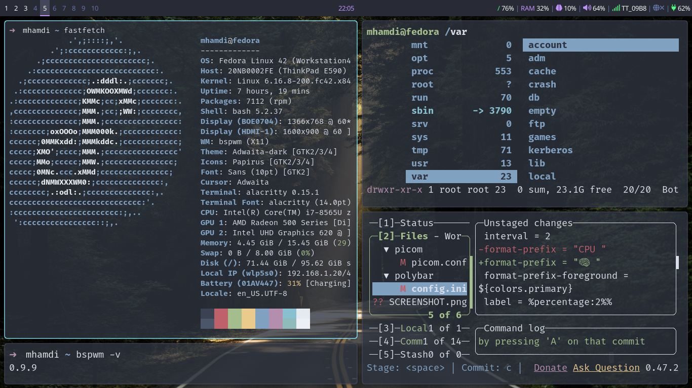

# BSPWM Configuration

A complete `BSPWM` (**Binary Space Partitioning Window Manager**) setup.



## Included Components

- **BSPWM**: Tiling window manager
- **SXHKD**: Hotkey daemon for keyboard shortcuts
- **Polybar**: Status bar with workspace indicators
- **Rofi**: Application launcher and window switcher
- **Dunst**: Desktop notification daemon
- **Picom**: Compositor for visual effects
- **Alacritty**: Terminal emulator

## Quick Start

### Installation

**Clone the repository**:
```bash
git clone git@gtihub.com:a-mhamdi/bspwm
cd bspwm
```

## Key Bindings

| Key Combination | Action |
|----------------|--------|
| `Super + Return` | Open terminal (Alacritty) |
| `Super + Space` | Open application launcher (Rofi) |
| `Alt + Tab` | Window switcher |
| `Super + H/J/K/L` | Focus window (left/down/up/right) |
| `Super + Shift + H/J/K/L` | Move window |
| `Super + 1-9,0` | Switch to desktop |
| `Super + Shift + 1-9,0` | Move window to desktop |
| `Super + W` | Close window |
| `Super + Shift + W` | Kill window |
| `Super + T` | Toggle tiled/floating |
| `Super + F` | Toggle fullscreen |
| `Super + Escape` | Reload SXHKD config |
| `Super + Alt + Q` | Quit BSPWM |
| `Super + Alt + R` | Restart BSPWM |

## Configuration Files

The playbook creates the following configuration files:

- `~/.config/bspwm/bspwmrc` - BSPWM main configuration
- `~/.config/sxhkd/sxhkdrc` - Keyboard shortcuts
- `~/.config/polybar/config.ini` - Status bar configuration
- `~/.config/polybar/launch.sh` - Polybar launch script
- `~/.config/rofi/config.rasi` - Rofi launcher configuration
- `~/.config/rofi/theme.rasi` - Rofi theme
- `~/.config/dunst/dunstrc` - Notification daemon configuration
- `~/.xinitrc` - X11 startup script

## Customization

### Colors and Themes
- Edit `~/.config/bspwm/bspwmrc` for window colors and borders
- Modify `~/.config/polybar/config.ini` for status bar appearance
- Customize `~/.config/rofi/theme.rasi` for launcher styling

### Adding New Hotkeys
Edit `~/.config/sxhkd/sxhkdrc` and reload with `Super + Escape`

### Polybar Modules
The default setup includes:
- `BSPWM` workspace indicators
- System date and time
- Notification tray

### Target Machine Packages
- `bspwm` - Window manager
- `sxhkd` - Hotkey daemon
- `polybar` - Status bar
- `rofi` - Application launcher
- `dunst` - Notification daemon
- `picom` - Compositor
- `alacritty` - Terminal emulator
- `feh` - Image viewer (for wallpapers)
- `font-awesome` - Icon fonts

## Troubleshooting

### Common Issues

1. **BSPWM not starting**: Check if `~/.xinitrc` is executable
2. **Polybar not showing**: Verify `~/.config/polybar/launch.sh` is executable
3. **Hotkeys not working**: Ensure SXHKD is running (`sxhkd &`)
4. **Missing fonts**: Install `font-awesome` package

### Debug Commands
```bash
# Check if BSPWM is running
ps aux | grep bspwm

# Check SXHKD status
ps aux | grep sxhkd

# Test Polybar manually
~/.config/polybar/launch.sh

# Reload BSPWM config
bspc wm -r
```

## License

This project is licensed under the MIT License - see the [LICENSE](LICENSE) file for details.

---
